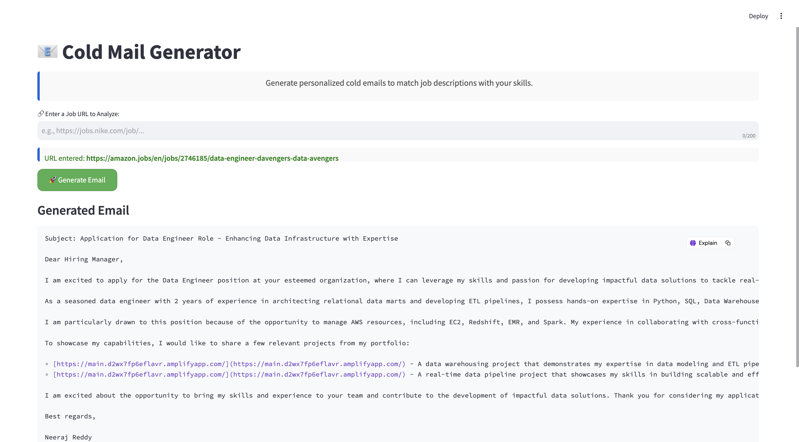
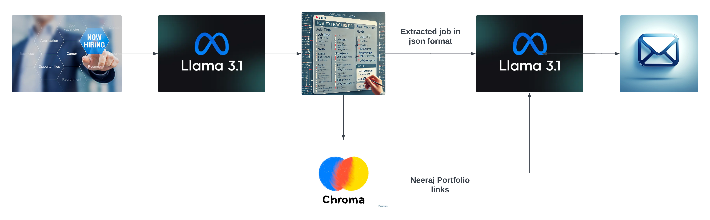

# 📧 Cold Mail Generator
## Overview
The Cold Email Generator is a streamlined application that allows users to extract job descriptions from career websites and generate personalized cold emails. By matching the job requirements with a user's skills and portfolio, the tool automatically writes relevant cold emails to potential recruiters.

This app is built using Streamlit for the user interface, LangChain for natural language processing, and ChromaDB for vector-based storage of portfolio data. The core functionality revolves around extracting job information from a webpage, processing it using a Language Learning Model (LLM), and then generating a customized email with portfolio links based on the job's skills.

## Features
1. Job Data Extraction: Extracts job roles, experience, skills, and descriptions from career pages.
2. Portfolio Integration: Matches job-required skills with a stored Neeraj portfolio and retrieves relevant portfolio links.
3. Cold Email Generation: Uses the extracted job data and portfolio links to generate personalized cold emails for recruiters.
4. Streamlit Interface: Provides a simple web interface for users to enter job URLs and receive generated emails.

## Components
### chains.py:
Implements the core logic for job extraction and cold email generation using LangChain's LLM (LLaMA 3.1).
It extracts job postings from career pages and returns them in JSON format.
Generates cold emails by using the user's provided job description and portfolio links.
### portfolio.py:
Handles portfolio loading and querying using ChromaDB.
Stores the user's portfolio in a vectorized format (Techstack and links).
Queries the portfolio to match the job-required skills and retrieves the most relevant links.
### app.py (Streamlit app):
Provides a simple web interface where users input job URLs.
Loads job information, runs the LLM to generate emails, and displays the results.
Cleanly integrates the functionality of chains.py and portfolio.py to offer a user-friendly experience.

## Architecture Diagram

## Set-up
### Enter a Job URL:
The user provides a URL from a company's career page.

### Job Data Extraction:
The app scrapes the job data (title, skills, experience, description) from the URL using LangChain and presents it in a structured JSON format.

### Portfolio Matching:
The app matches the required job skills with Neeraj Reddy's stored portfolio, which contains links showcasing Neeraj's work.

### Cold Email Generation:
Based on the job description and matched portfolio links, the app automatically generates a cold email tailored for that job, ready for submission.

   
